## 技术栈

 typescript electron vue3 sass sqlite3

## 主要内容

- 配置Electron热更新开发环境以及node worker的打包
- 实现EPub格式的解析和渲染（非使用第三方库）
- 使用生成器和requestAnimationFrame优化全书搜索
- 使用二分查找快速定位阅读位置
- 使用svg实现非嵌套文本高亮
- 使用Sqlite进行数据持久化存储

## 项目架构

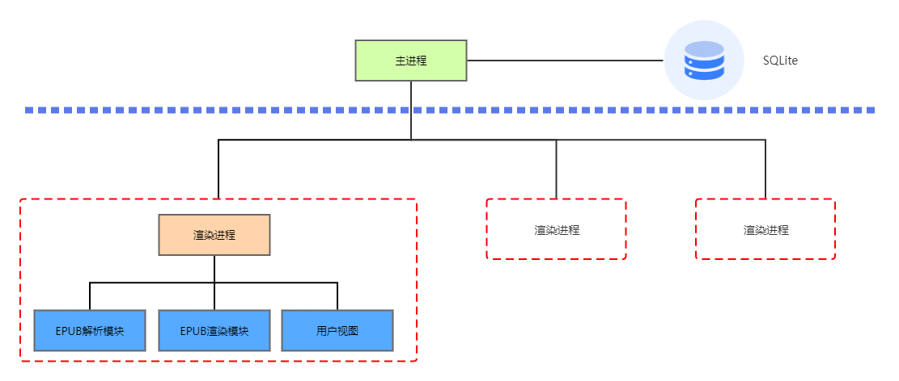

## 主要功能

- 电子书管理
- 书签
- 高亮
- 全文搜索
- 电子书样式修改
- 程序主题切换

## 演示

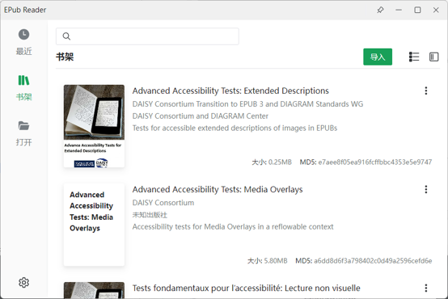

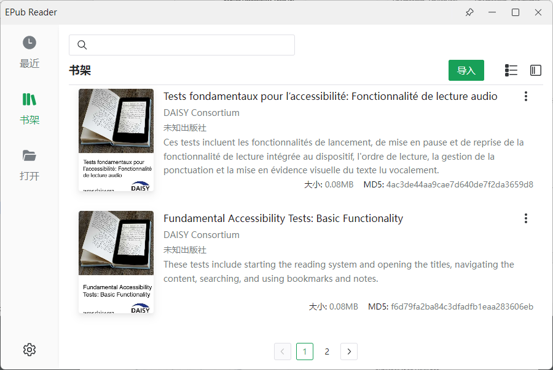

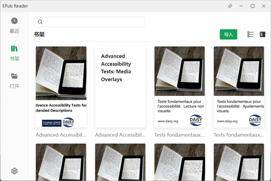

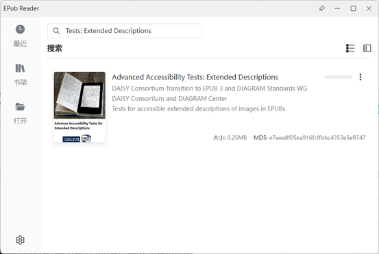

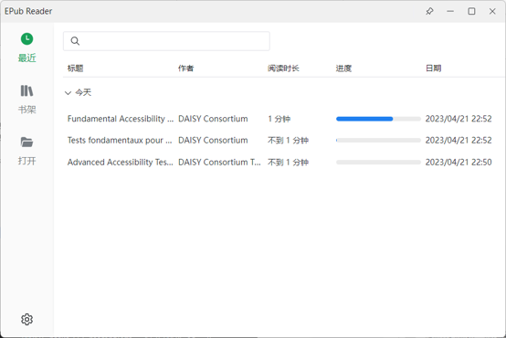

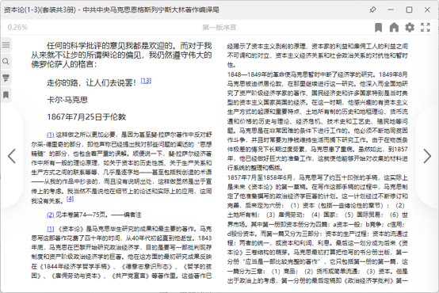

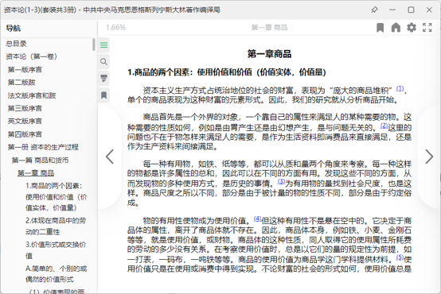

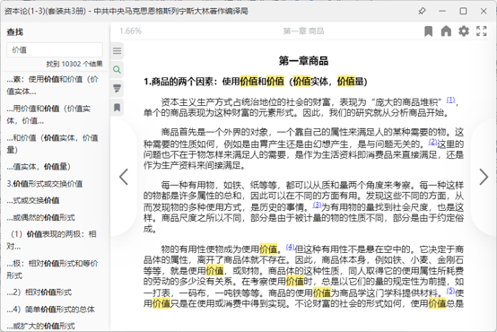

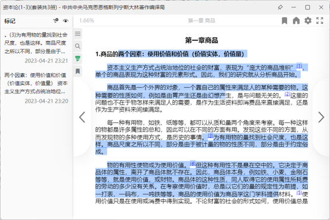

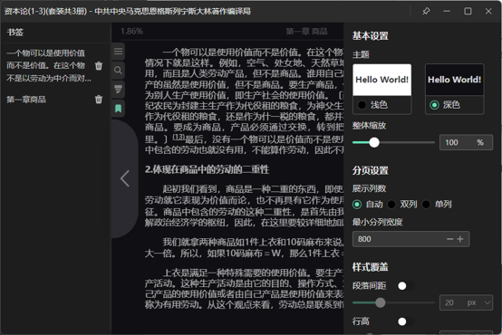

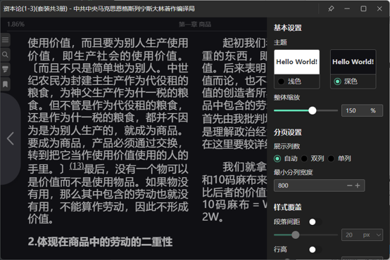